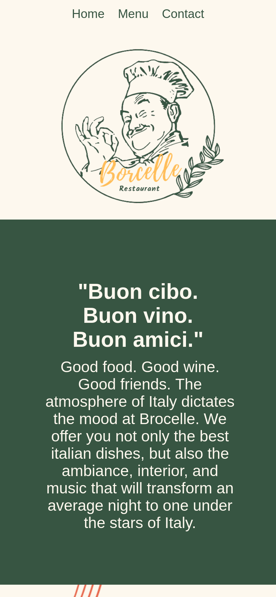

# Restaurant Website

## Demo 
https://ken862734801.github.io/restaurant-website/

## Preview

View on mobile.

## Summary

The goal of this Odin Project assignment was to use Webpack and CSS to create a mock restaurant website.

[Link to the assignment.](https://www.theodinproject.com/lessons/node-path-javascript-restaurant-page)

At the beginning of this assignment, I couldn't really understanding the benefits of webpack; however, upon completing the website I'm starting to realize just how value it is to be able to bundle and separate code into more manageable sections. That being said, there are still some sections of "spaghetti code" that I plan to come back to and refactor in the future. The page is somewhat responsive, but I plan to add additional media queries at more of the common break points for a more uniform look throughout. 

### Features
- Tab navigation between the home, menu, and contact section.

## Resources

I spent a good amount of time looking up website templates and came across very interesting designs on behance and dribble. I took major insipration from them but made sure to make some "artistic liberties". I also used canva to "create" the logo and had to use photoshop to make edits for the background image.

### Canva
https://www.canva.com/

### The template design.
https://www.behance.net/gallery/126934495/Brama

### Links to the photographers of the images used in this project. 

https://unsplash.com/@animavisual

https://unsplash.com/@liubovilchuk
  
https://unsplash.com/@albertvincentwu

